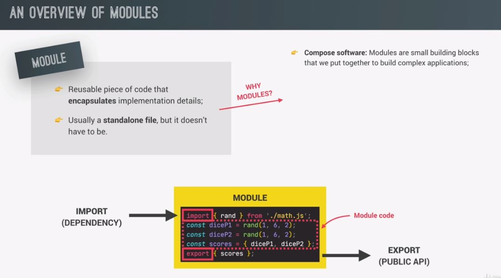

# JavaScript and TypeScript Notes

  

### Table of Contents

Hide/Show table of contents

| No. | Questions                       |
| --- | ------------------------------- |
| 1   | [Modules in JS](#modules-in-JS) |
| 2   |                                 |
| 3   |                                 |
| 4   |                                 |
| 5   |                                 |

1. ### Modules in JS

   There are many ways to create objects in javascript as mentioned below:

   What's a module?

   Modules are a super important part of software development.

   [:one:]:one: Modules naturally lead to a more organized code. 
   2️⃣ Modules are a reusable piece of code that encapsulates implementation details
   of a certain part of our project. Like a function or even a class, but the difference
   is that a module is usually a standalone and separate file. 
   3️⃣ Whatever we export from a module is called the public API. So this
   is just like classes where we can also expose a public API for other codes to consume. 

   Now, in the case of modules, this public API is actually consumed by importing values into a module.
   So just like we can export values in modules, we can usually also import values from other modules.
   And these other modules from which we import are then called dependencies of the importing module
   because the code that is in the module that is importing cannot work without the code, that it is
   importing from the external module, right?

   **Note:** This is one of the easiest ways to create an object.

   **[⬆ Back to Top](#table-of-contents)**

      <!--  -->

2. ### Work in Progress
